# YuJiDi Critical Flows

This file is the top-level data-flow map for YuJiDi. It focuses on user journeys and event-driven architecture.

Detailed service-flow documents:

- [WebSocket Service Flow](./WEBSOCKET_SERVICE_FLOW.md)
- [Scoring Template Service Flow](./SCORING_TEMPLATE_SERVICE_FLOW.md)
- [Trade Monitoring Service Flow](./TRADE_MONITORING_SERVICE_FLOW.md)

Supporting maps:

- [Route Map](./ROUTE_MAP.md)
- [Domain Map](./DOMAIN_MAP.md)
- [Data Model Map](./DATA_MODEL_MAP.md)
- [Frontend Map](./FRONTEND_MAP.md)
- [Debug Playbook](./DEBUG_PLAYBOOK.md)
- [Architecture Guardrails](./ARCHITECTURE_GUARDRAILS.md)

## Mental Model

YuJiDi has two kinds of flows:

1. Request/response flows: user clicks a button, frontend calls an HTTP route, backend validates and writes/reads MongoDB.
2. Event-driven flows: exchange ticks arrive asynchronously, update runtime state, emit WebSocket payloads, generate alerts, and evaluate active trades.

```txt
HTTP user journey
  -> route
  -> controller
  -> service
  -> model
  -> response

Market event journey
  -> provider socket
  -> normalized tick
  -> snapshot/analyzer/monitoring
  -> persisted event or WebSocket payload
```

## Route-To-Service Flow

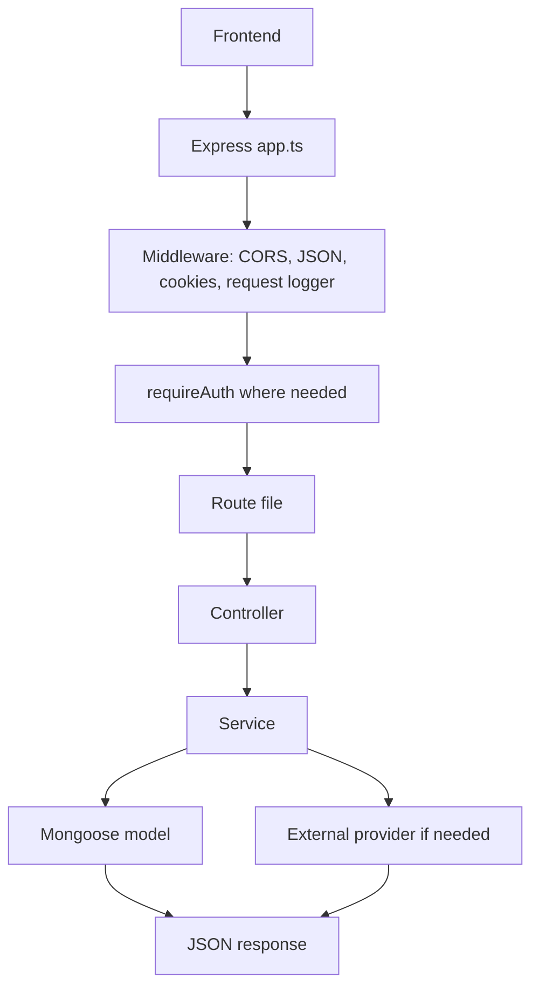

## WebSocket And Market Data Overview

See [WebSocket Service Flow](./WEBSOCKET_SERVICE_FLOW.md) for the deep dive.

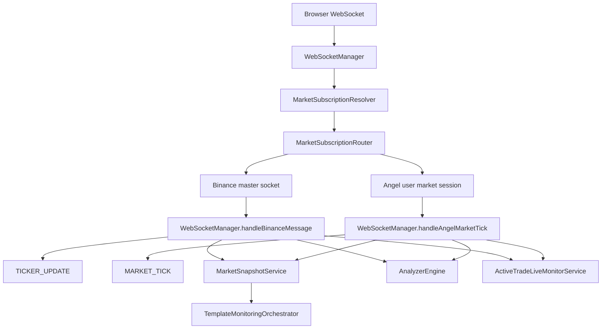

The frontend uses one YuJiDi WebSocket. The backend decides whether a subscription goes to Binance or Angel.

## Subscription Resolution Flow

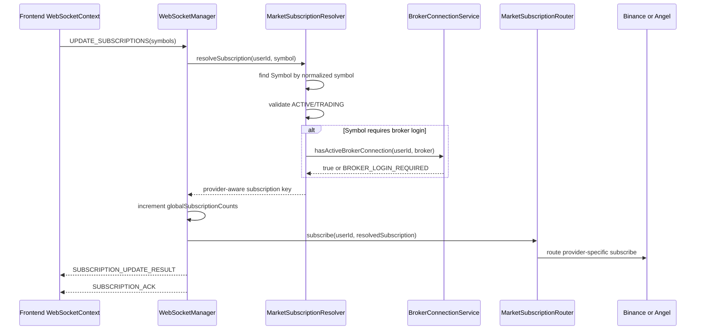

Example keys:

```txt
BINANCE:BINANCE:BTCUSDT
ANGEL_ONE:<userId>:MCX:495213
ANGEL_ONE:<userId>:NSE:2885
```

## Binance Live Data Flow

```mermaid
flowchart TD
  B[Binance combined websocket] --> WS[WebSocketManager.handleBinanceMessage]
  WS -->|24hrTicker| Ticker[TICKER_UPDATE to browser]
  WS -->|24hrTicker| Snap[MarketSnapshotService.recordTick]
  Snap --> TMO[TemplateMonitoringOrchestrator.recordSnapshot]
  WS -->|24hrTicker| ATM[ActiveTradeLiveMonitorService.handleTick]
  WS -->|aggTrade| Analyzer[AnalyzerEngine.processTick]
  WS -->|depth20@100ms| Depth[AnalyzerEngine.updateOrderBook]
  Analyzer --> Alert[AlertModel.create + NEW_ALERT]
  ATM --> TradeEvent[TradeMonitoringService + TradeEvent]
```

Binance stream usage:

- `ticker`: dashboard live rate, snapshot service, active-trade monitoring.
- `aggTrade`: analyzer price buffer and CVD.
- `depth20@100ms`: analyzer order book support/resistance.

## Angel Live Data Flow

See [WebSocket Service Flow](./WEBSOCKET_SERVICE_FLOW.md) for packet parsing and provider details.

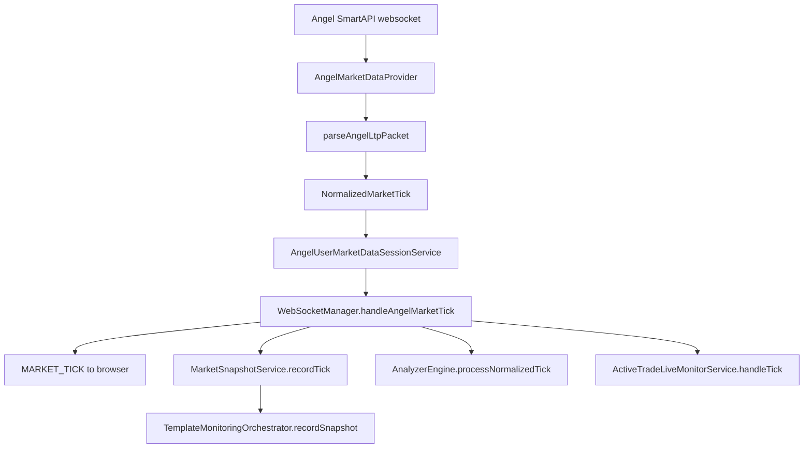

Angel live ticks are user-scoped. The analyzer and active-trade monitoring require `userId` for Angel data.

## Analyzer Alert Flow

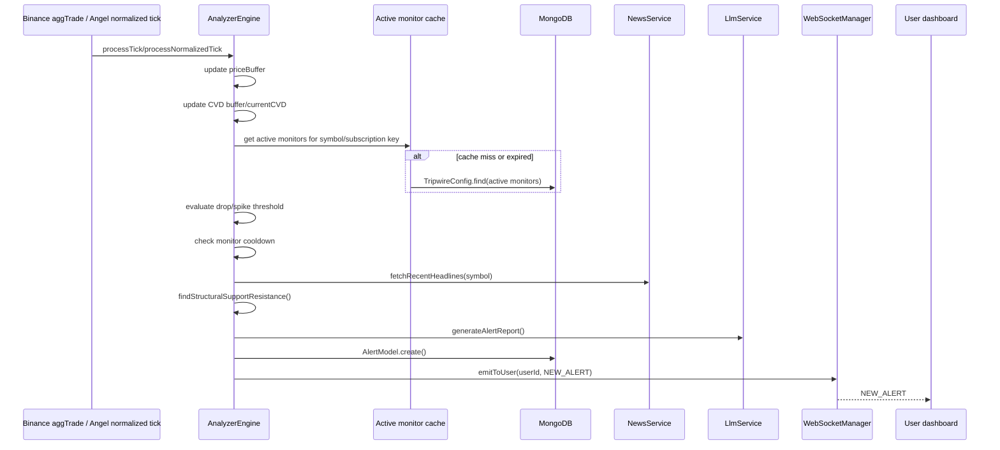

Analyzer state:

- `priceBuffer`: sliding price history by stream key.
- `cvdBuffer`: recent buyer/seller delta.
- `currentCVD`: running CVD value.
- `cooldowns`: duplicate alert prevention per monitor.
- `orderBookSnapshot`: latest Binance depth snapshot.
- `activeMonitorCache`: short TTL active monitor cache.

Important provider difference:

```txt
Binance monitor lookup can be global by provider/exchange/token.
Angel monitor lookup is user-scoped by user/provider/exchange/instrumentToken.
```

## Market Snapshot And Template Resource Flow

See [Scoring Template Service Flow](./SCORING_TEMPLATE_SERVICE_FLOW.md) for template details.

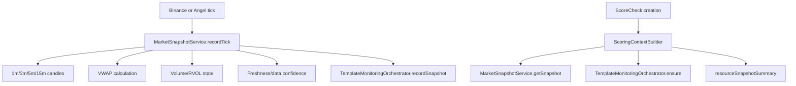

The snapshot service turns raw ticks into reusable scoring context:

- latest price
- previous price
- spread
- candle summary
- VWAP
- volume/RVOL
- freshness
- data confidence

## Scoring Template Creation And Monitoring Flow

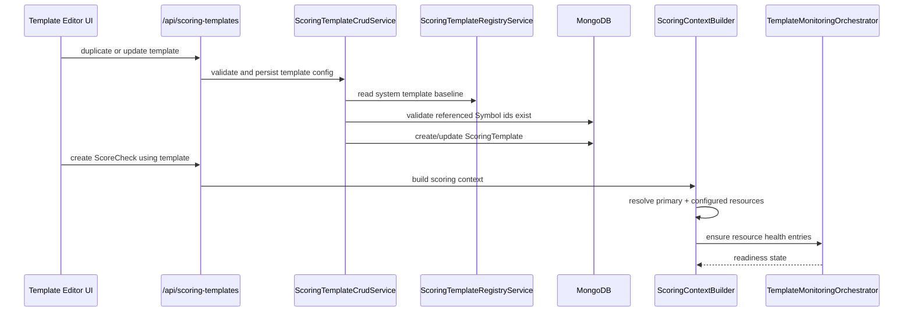

Template parameters coordinate with monitoring like this:

```txt
resourceConfig
  -> tells builder which extra symbols to inspect

allowedTradableSymbols
  -> tells ScoreCheck which primary symbols are allowed

sectionOverrides
  -> tells scoring how section weight should be distributed

snapshotPolicy
  -> tells scoring how fresh the captured market context should be
```

## ScoreCheck Creation

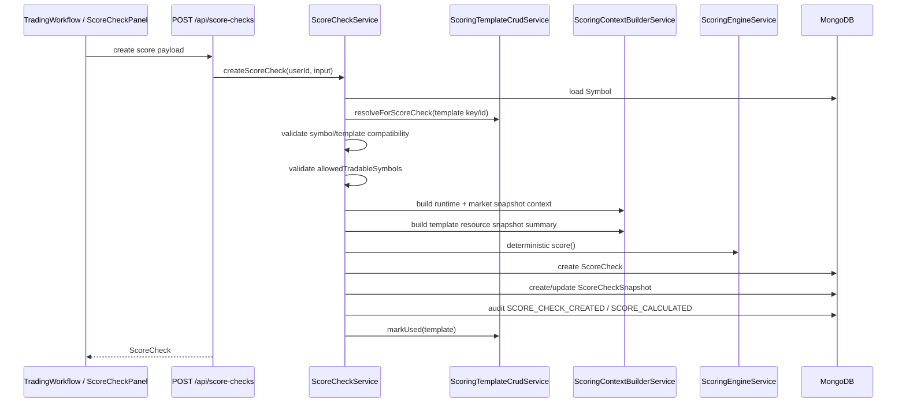

## ScoreCheck To TradeSetup Conversion

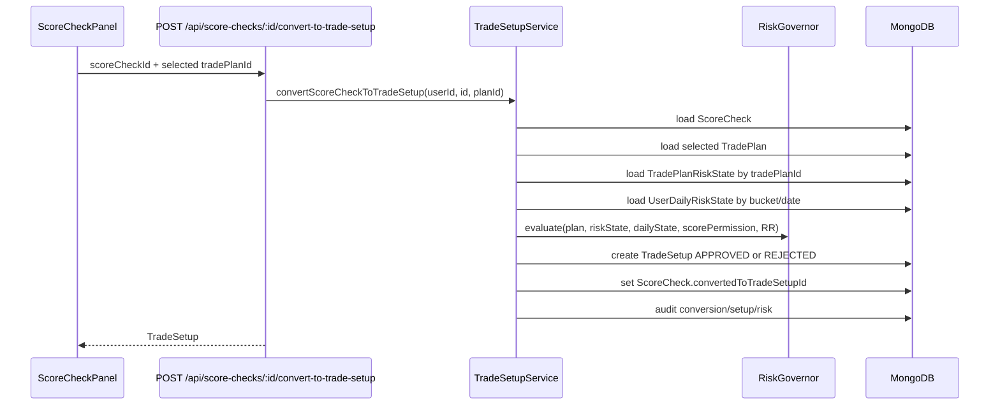

RiskGovernor is deterministic final authority for trade permission. ScoreCheck does not mutate risk state.

## TradePlan Activation / Risk State

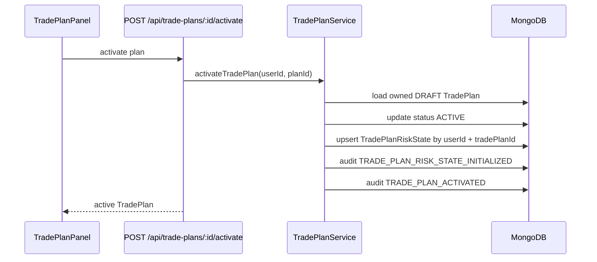

## ActiveTrade Confirmation

See [Trade Monitoring Service Flow](./TRADE_MONITORING_SERVICE_FLOW.md) for the live monitoring continuation.

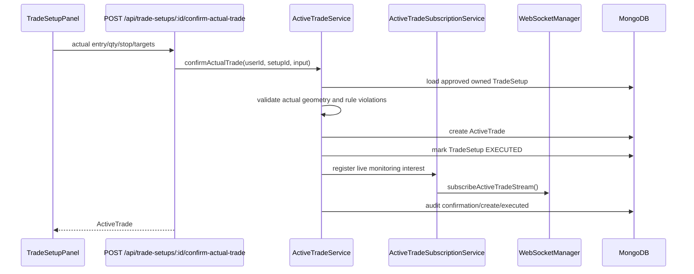

## Live Tick To TradeEvent

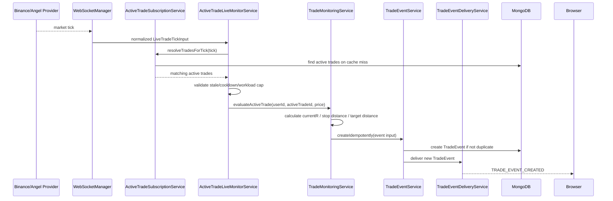

## Trade Close To TradeResult

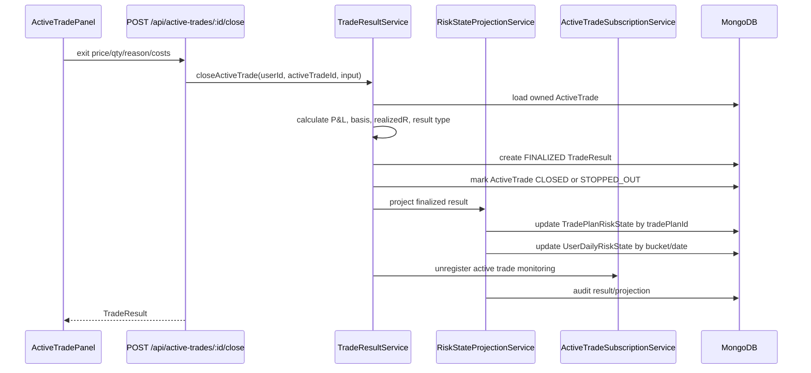

## TradeResult To Journal / AI Review

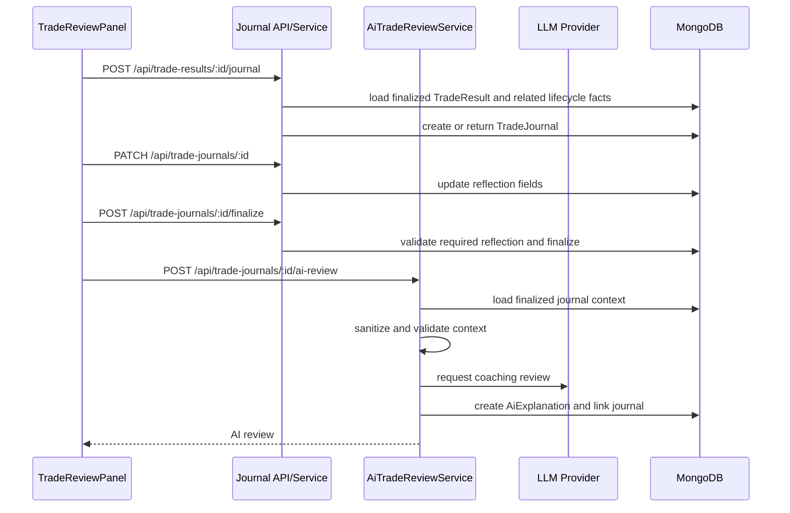

AI review is post-trade coaching only. It cannot score, approve, execute, close, or mutate risk.

## End-To-End Event-Driven View

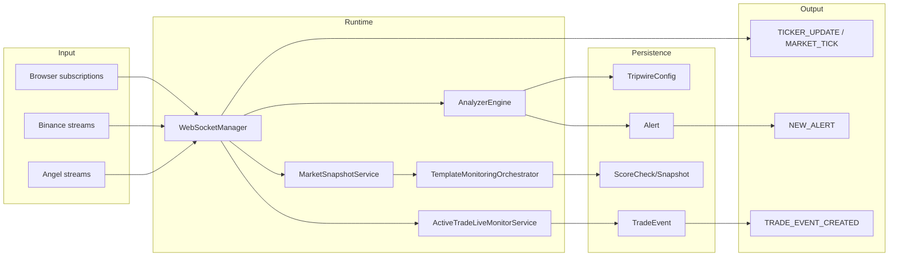

This is the core YuJiDi event-driven architecture:

```txt
market data is not a single feature
market data is shared runtime fuel for
  dashboard live rates
  analyzer alerts
  scoring template snapshots
  active-trade monitoring
  trade-event delivery
```
