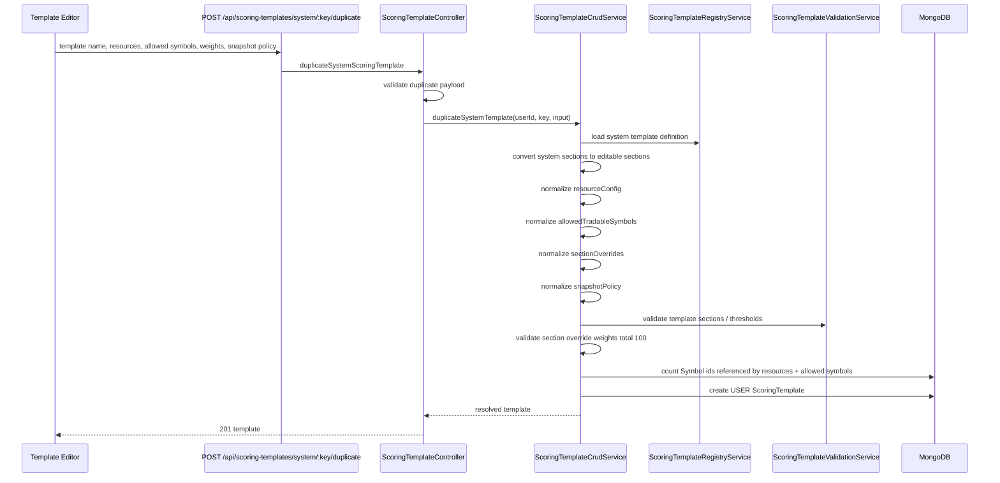
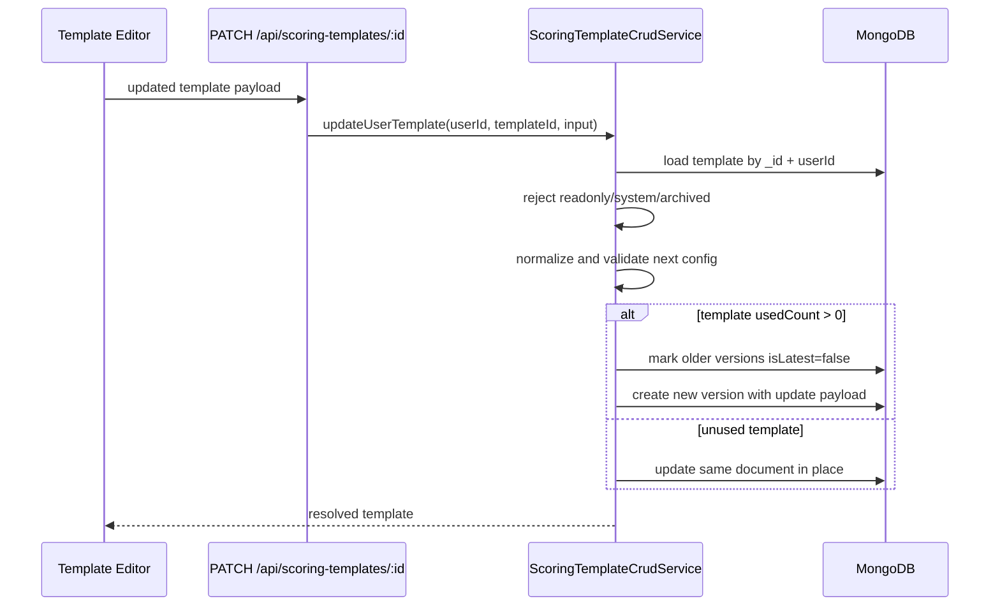
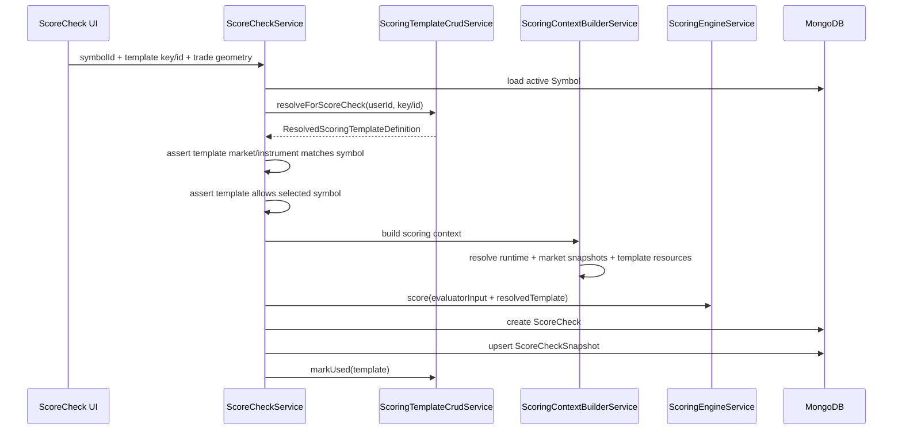
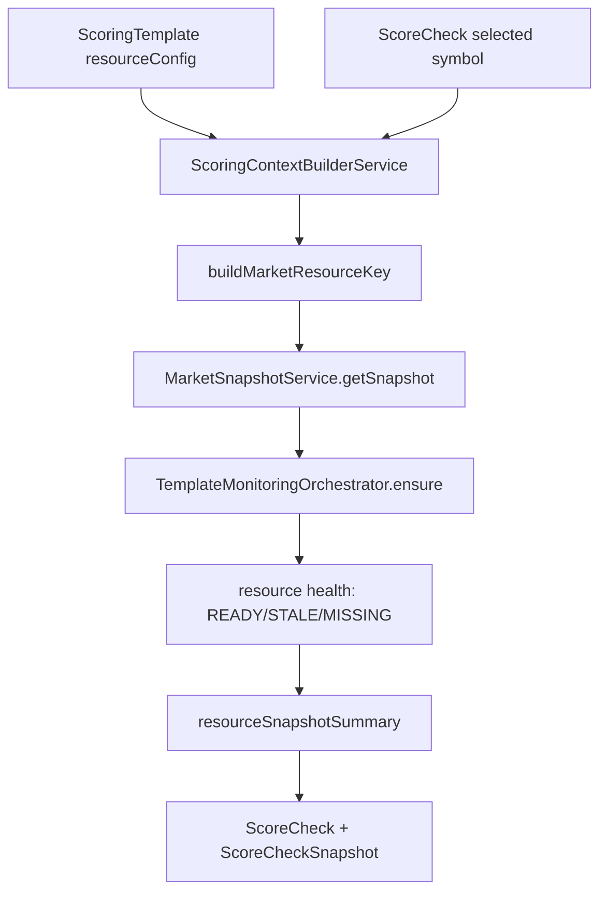
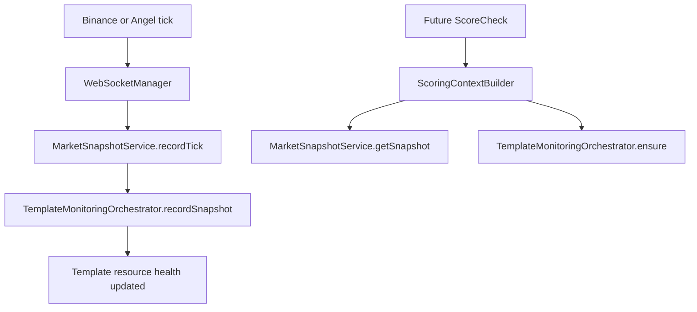

# YuJiDi Scoring Template Service Flow

This document explains template creation, editing, validation, resource configuration, allowed tradable symbols, snapshot policy, and how templates coordinate with ScoreCheck and monitoring.

Primary files:

- `yujidi-server/src/routes/scoring-template.routes.ts`
- `yujidi-server/src/controllers/scoring-template.controller.ts`
- `yujidi-server/src/services/scoring-template-crud.service.ts`
- `yujidi-server/src/services/scoring-template-registry.service.ts`
- `yujidi-server/src/services/scoring-template-validation.service.ts`
- `yujidi-server/src/models/scoring-template.model.ts`
- `yujidi-server/src/services/score-check.service.ts`
- `yujidi-server/src/services/scoring-context-builder.service.ts`
- `yujidi-server/src/services/template-resource-resolver.service.ts`
- `yujidi-server/src/services/template-monitoring-orchestrator.service.ts`

## Purpose

Scoring templates are YuJiDi's pre-trade rule books.

A template defines:

- Which market and instrument type it applies to.
- Which scoring sections exist.
- How much each section matters.
- Which resources should be captured around a score check.
- Which symbols are allowed to be scored with the template.
- How strict snapshot freshness should be.

Example:

```txt
India Equity Intraday Custom
  marketType = EQUITY
  instrumentType = CASH
  market index = NIFTY
  bank index = BANKNIFTY
  volatility = INDIA VIX
  sector index = NIFTY IT
  allowed tradable symbols = INFY, TCS, HDFCBANK
  section weights total = 100
```

## Route Flow

All scoring template routes are authenticated:

```txt
/api/scoring-templates
  -> requireAuth
  -> scoring-template.controller
  -> ScoringTemplateCrudService
```

Routes:

```txt
GET  /api/scoring-templates
GET  /api/scoring-templates/system/:templateKey
POST /api/scoring-templates/system/:templateKey/duplicate
GET  /api/scoring-templates/:id
PATCH /api/scoring-templates/:id
POST /api/scoring-templates/:id/archive
```

## Template Creation Flow

User templates are created by duplicating a system template.



## System Template vs User Template

System templates:

- Come from `ScoringTemplateRegistryService`.
- Are readonly.
- Are not edited directly.
- Act as baseline playbooks.

User templates:

- Are MongoDB records.
- Belong to one user.
- Can be edited unless archived.
- Keep `baseTemplateKey` to remember the system template they came from.

```txt
SYSTEM template
  -> duplicate
  -> USER template
  -> edit resourceConfig / allowed symbols / weights
  -> use in ScoreCheck
```

## Data Model Fields

`ScoringTemplate` stores:

- `scope`: `SYSTEM` or `USER`.
- `userId`: owner for user templates.
- `templateKey`: unique key for this template/version.
- `baseTemplateKey`: original system template key.
- `templateName`: user-visible name.
- `marketType`: `CRYPTO`, `EQUITY`, `FNO`, `COMMODITY`, etc.
- `tradeStyle`: intraday/scalping style.
- `instrumentType`: `SPOT`, `CASH`, `FUTURE`, `OPTION`, etc.
- `version`: template version.
- `isLatest`: marks latest active version.
- `isReadonly`: prevents editing system templates.
- `status`: `ACTIVE`, `DRAFT`, or `ARCHIVED`.
- `sections`: scoring sections and evaluator definitions.
- `permissionThresholds`: score-to-permission thresholds.
- `resourceConfig`: market/index/sector/related symbol resources.
- `allowedTradableSymbols`: whitelist of symbols that can use the template.
- `sectionOverrides`: user-defined section weight overrides.
- `snapshotPolicy`: rules for snapshot capture/freshness.
- `usedCount` and `lastUsedAt`: usage tracking.

## Resource Config

`resourceConfig` tells YuJiDi which extra symbols matter when scoring.

```txt
resourceConfig.marketRegime.marketIndexSymbolId
resourceConfig.marketRegime.bankIndexSymbolId
resourceConfig.marketRegime.volatilitySymbolId
resourceConfig.sectorContext.sectorName
resourceConfig.sectorContext.sectorIndexSymbolId
resourceConfig.relatedSymbols[]
```

Example:

```txt
Primary score symbol: INFY
Market index: NIFTY
Bank index: BANKNIFTY
Volatility: INDIA VIX
Sector: NIFTY IT
Related: TCS
```

The primary symbol comes from the ScoreCheck. The rest come from template configuration.

## Allowed Tradable Symbols

`allowedTradableSymbols` is a whitelist.

If a user template allows only:

```txt
INFY, TCS, HDFCBANK
```

then a ScoreCheck for `CRUDEOIL` or `BTCUSDT` should not use that template.

This prevents strategy misuse:

```txt
India Equity Intraday template
  should not score
MCX commodity options
```

## Validation Rules

Template create/update validates:

- ObjectId shape for every symbol id.
- Resource symbols exist in `Symbol` collection.
- Allowed symbols exist in `Symbol` collection.
- `allowedTradableSymbols` values are unique.
- `sectionOverrides.sectionKey` values are unique.
- Enabled section override weights total exactly 100.
- User can only edit their own user template.
- Readonly/system templates cannot be edited.
- Archived templates cannot be updated.

## Update And Versioning Flow



Why versioning exists:

```txt
ScoreCheck history must remain explainable.
If a template was already used, later edits should not silently rewrite the past.
```

## ScoreCheck Coordination

During ScoreCheck creation:



The template does not execute a trade. It only controls how the trade idea is scored.

## Template Monitoring Coordination

Template monitoring is resource-health tracking around symbols required by scoring.



`TemplateMonitoringOrchestrator` tracks:

- `resourceKey`
- `registeredAt`
- `lastTickAt`
- `lastSnapshotStatus`
- `refCount`

It does not fetch ticks itself. It observes snapshots that are fed by WebSocket market data.

## How Live Ticks Keep Template Resources Fresh



This means template monitoring is event-driven:

```txt
ticks update snapshots
snapshots update resource health
score checks read that health
```

## Output Shapes

List templates returns summaries:

```json
{
  "status": "success",
  "data": [
    {
      "templateKey": "INDIA_EQUITY_INTRADAY_V1",
      "scope": "SYSTEM",
      "isReadonly": true
    },
    {
      "id": "...",
      "templateKey": "USER_INDIA_EQUITY_INTRADAY_V1_...",
      "scope": "USER",
      "isReadonly": false,
      "resourceConfig": {},
      "allowedTradableSymbols": [],
      "sectionOverrides": [],
      "snapshotPolicy": {}
    }
  ]
}
```

ScoreCheck output can include a resource snapshot summary:

```json
{
  "resourceReadinessSummary": {
    "total": 4,
    "ready": 2,
    "stale": 1,
    "missing": 1,
    "blockingMissing": 1
  },
  "warnings": ["SECTOR_INDEX market snapshot is MISSING"],
  "blockers": ["MARKET_INDEX market snapshot is missing"]
}
```

## Interview Summary

Scoring templates are versioned, user-customizable rule books. System templates live in a registry and are duplicated into private user templates. User templates store scoring sections, resource configuration, allowed tradable symbols, section overrides, and snapshot policy. ScoreCheck resolves a template, verifies the selected symbol is compatible and allowed, builds market/runtime context, and runs deterministic scoring. Template monitoring is coordinated through market snapshots and `TemplateMonitoringOrchestrator`, which tracks whether required resources like index, sector, VIX, and the primary symbol are ready, stale, or missing.
