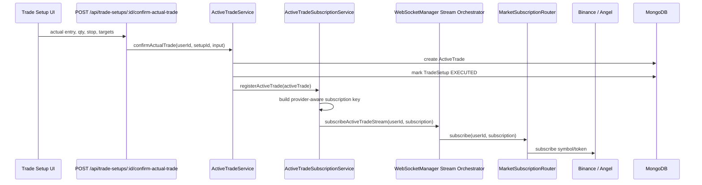
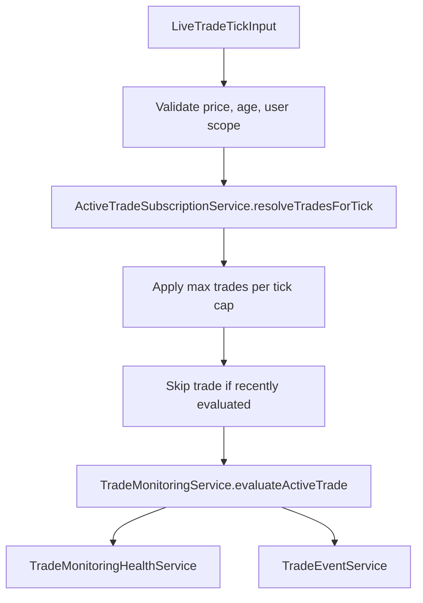
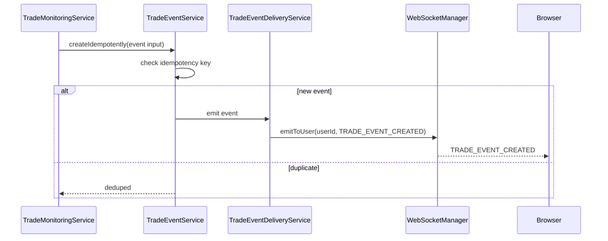

# YuJiDi Trade Monitoring Service Flow

This document explains active-trade monitoring from actual trade confirmation through live market tick evaluation, event creation, event delivery, and health tracking.

Primary files:

- `yujidi-server/src/services/trading/active-trade.service.ts`
- `yujidi-server/src/services/trading/active-trade-subscription.service.ts`
- `yujidi-server/src/services/trading/active-trade-live-monitor.service.ts`
- `yujidi-server/src/services/trading/trade-monitoring.service.ts`
- `yujidi-server/src/services/trading/trade-event.service.ts`
- `yujidi-server/src/services/trading/trade-event-delivery.service.ts`
- `yujidi-server/src/services/trading/trade-monitoring-health.service.ts`
- `yujidi-server/src/services/trading/websocket.service.ts`
- `yujidi-server/src/utils/market-subscription-key.ts`

## Purpose

Trade monitoring watches confirmed active trades against live prices and creates deterministic trade events.

It answers:

- Did price hit stop loss?
- Did price hit target 1?
- Did price hit target 2?
- Did trade reach +1R?
- Is price near stop loss?
- Was an event already created?

It does not close the trade. Closing is owned by `TradeResultService`.

## Lifecycle Overview

```txt
TradeSetup approved
  -> user confirms actual trade
  -> ActiveTrade created
  -> ActiveTradeSubscriptionService registers live interest
  -> WebSocketManager routes provider stream
  -> live ticks arrive
  -> ActiveTradeLiveMonitorService matches ticks to active trades
  -> TradeMonitoringService evaluates thresholds
  -> TradeEventService creates idempotent events
  -> TradeEventDeliveryService emits events to frontend
```

## Confirm Actual Trade To Monitoring Registration



This means live monitoring starts immediately after actual trade confirmation.

## Active Trade Subscription Key

`ActiveTradeSubscriptionService` converts an `ActiveTrade` into a provider-aware stream identity.

Examples:

```txt
BINANCE:BINANCE:BTCUSDT
ANGEL_ONE:<userId>:MCX:495213
ANGEL_ONE:<userId>:NSE:2885
```

Why this matters:

- Binance data is global, so no user id is needed.
- Angel data is user-scoped, so user id is part of the key.
- Active trades and frontend monitors can share the same stream if they use the same key.

## Subscription Cache

`ActiveTradeSubscriptionService` keeps a short TTL cache:

```txt
subscriptionKey -> active trades for that resource
```

Purpose:

- Avoid querying MongoDB for every single market tick.
- Keep live monitoring fast.
- Still refresh when cache expires.

The cache is bounded by:

- TTL default around 5 seconds.
- Max keys.
- Max trades per key.

## Live Tick Handling

`ActiveTradeLiveMonitorService.handleTick()` is the live tick gatekeeper.



Skip reasons:

- `INVALID_TICK`
- `TICK_STALE`
- `USER_SCOPE_REQUIRED`
- `NO_SAFE_SYMBOL_MATCH`
- `COOLDOWN_ACTIVE`
- `WORKLOAD_CAP_REACHED`

This protects the system from bad ticks, stale provider packets, Angel ticks without user scope, and heavy tick bursts.

## Trade Monitoring Evaluation

`TradeMonitoringService.evaluateActiveTrade()` performs deterministic threshold checks.

Input:

```json
{
  "price": 59000,
  "source": "MARKET_TICK",
  "occurredAt": "2026-07-22T10:00:00.000Z"
}
```

Main calculations:

```txt
currentR = movement from actual entry / actual risk per unit
distanceToStopLossPercent = abs(price - stopLoss) / price * 100
distanceToTarget1Percent = abs(price - target1) / price * 100
```

For a LONG:

```txt
currentR = (price - actualEntry) / actualRiskPerUnit
stop hit = price <= currentStopLoss
target hit = price >= target
```

For a SHORT:

```txt
currentR = (actualEntry - price) / actualRiskPerUnit
stop hit = price >= currentStopLoss
target hit = price <= target
```

## Detected Events

Possible deterministic events:

- `SL_HIT`
- `TARGET_1_HIT`
- `TARGET_2_HIT`
- `PLUS_ONE_R_HIT`
- `PRICE_NEAR_SL`

Example LONG:

```txt
actualEntry = 100
currentStopLoss = 95
actualRiskPerUnit = 5
target1 = 110
current price = 105

currentR = (105 - 100) / 5 = +1R
event = PLUS_ONE_R_HIT
```

Example SHORT:

```txt
actualEntry = 100
currentStopLoss = 105
actualRiskPerUnit = 5
target1 = 90
current price = 95

currentR = (100 - 95) / 5 = +1R
event = PLUS_ONE_R_HIT
```

## Idempotent Trade Events

Trade events use an idempotency key:

```txt
<activeTradeId>:<eventType>
```

Example:

```txt
6a4306b990e25a0bb970acc0:TARGET_1_HIT
```

Why:

If price stays above target for 100 ticks, YuJiDi should not create 100 `TARGET_1_HIT` events for the same trade.

The first tick creates the event. Later ticks are deduped.

## Event Delivery



The frontend receives:

```json
{
  "type": "TRADE_EVENT_CREATED",
  "payload": {
    "eventType": "TARGET_1_HIT",
    "severity": "INFO",
    "price": 110,
    "currentR": 2
  }
}
```

## Manual Evaluation Route

Manual/synthetic evaluation exists through:

```txt
POST /api/active-trades/:id/evaluate
```

Flow:

```txt
HTTP route
  -> trade-monitoring.controller.evaluateActiveTrade
  -> TradeMonitoringService.evaluateActiveTrade
  -> TradeEventService.createIdempotently
```

Purpose:

- Debug monitoring rules.
- Test an active trade with a known price.
- Support manual operator checks.

Live monitoring and manual evaluation share the same core service.

## Health Tracking

`TradeMonitoringHealthService` receives operational events:

- tick seen
- evaluated
- skipped
- stale tick
- cooldown skip
- workload cap

This allows debugging questions like:

```txt
Is the symbol receiving ticks?
Are trades matched?
Are ticks skipped as stale?
Is cooldown suppressing evaluation?
Did workload cap prevent full evaluation?
```

## Binance vs Angel Monitoring

```txt
Binance tick
  -> provider = BINANCE
  -> exchange = BINANCE
  -> no userId required
  -> match active trades globally by symbol identity

Angel tick
  -> provider = ANGEL_ONE
  -> exchange = NSE/NFO/MCX
  -> userId required
  -> match active trades only for that user/session
```

## What Trade Monitoring Does Not Do

Trade monitoring does not:

- place orders
- modify stop loss automatically
- close trades automatically
- mutate risk state
- generate AI review
- recalculate ScoreCheck

It only creates deterministic events.

## Interview Summary

Trade monitoring begins after a user confirms actual execution. The `ActiveTradeService` creates the `ActiveTrade` and registers stream interest. `ActiveTradeSubscriptionService` builds a provider-aware key and caches active trades by key. Live ticks enter through `WebSocketManager`, are validated by `ActiveTradeLiveMonitorService`, matched to active trades, and evaluated by `TradeMonitoringService`. The monitoring service calculates current R, stop/target distances, detects events, and delegates idempotent event creation to `TradeEventService`. Events are delivered to the user over WebSocket without closing trades or mutating risk state.
