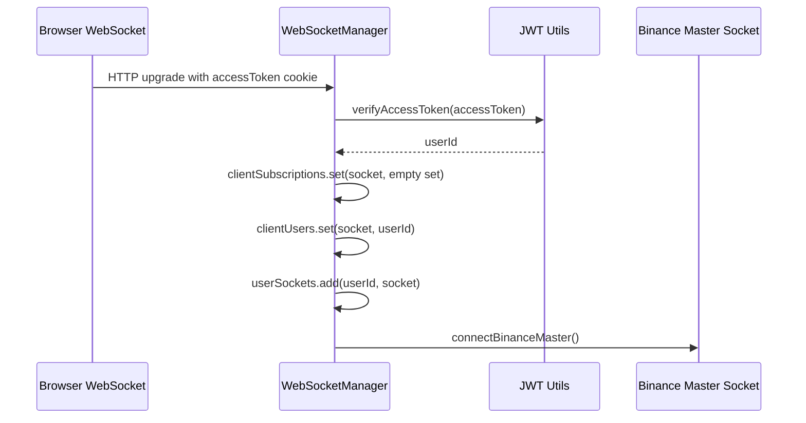
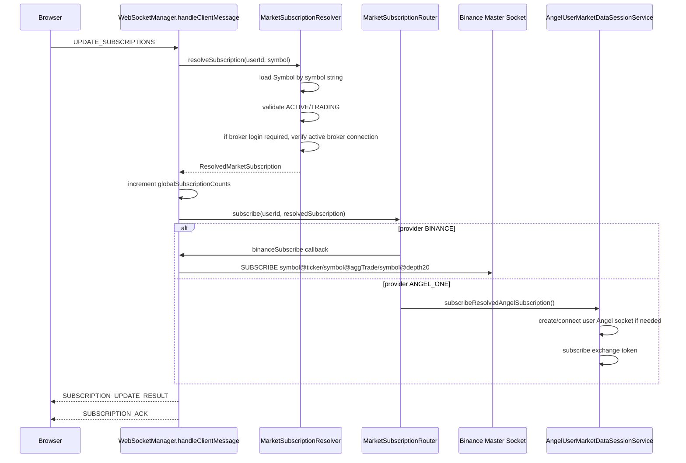
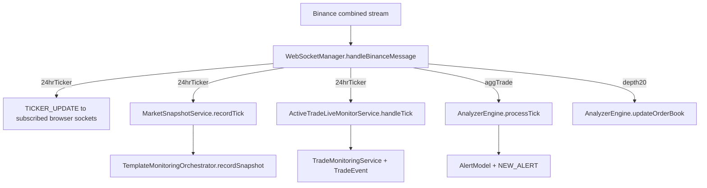
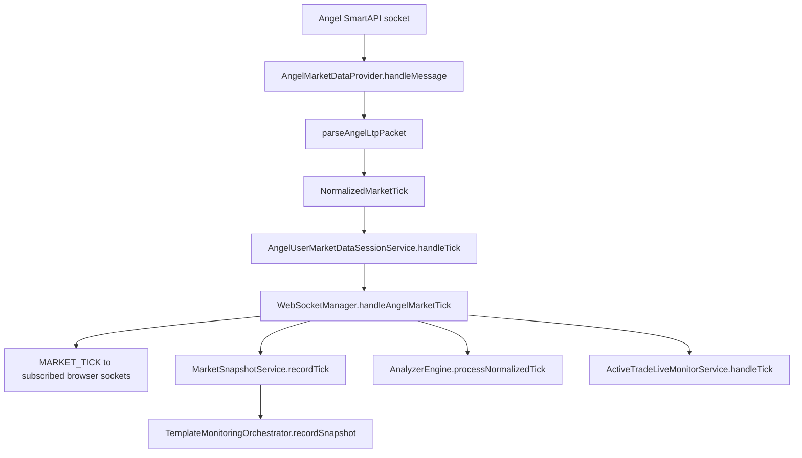

# YuJiDi WebSocket Service Flow

This document explains how `WebSocketManager` coordinates browser sockets, Binance streams, Angel user streams, analyzer input, market snapshots, template resource health, and active-trade monitoring.

Primary files:

- `yujidi-server/src/services/trading/websocket.service.ts`
- `yujidi-server/src/services/market-data/market-subscription-resolver.service.ts`
- `yujidi-server/src/services/market-data/market-subscription-router.service.ts`
- `yujidi-server/src/services/market-data/angel-user-market-data-session.service.ts`
- `yujidi-server/src/integrations/market-data/angel/angel-market-data.provider.ts`
- `yujidi-server/src/services/market-data/market-snapshot.service.ts`
- `yujidi-server/src/services/trading/analyzer.service.ts`
- `yujidi-server/src/services/trading/active-trade-live-monitor.service.ts`

## Purpose

The WebSocket service is the event-driven market-data spine of YuJiDi.

It has four jobs:

1. Authenticate browser WebSocket connections.
2. Resolve frontend symbol strings into provider-aware subscription keys.
3. Route subscriptions to Binance or user-scoped Angel streams.
4. Fan market ticks into UI updates, market snapshots, analyzer alerts, template health, and active-trade monitoring.

## High-Level Shape

```txt
Browser WebSocket
  -> WebSocketManager
  -> MarketSubscriptionResolver
  -> MarketSubscriptionRouter
  -> Binance master socket or Angel user session
  -> normalized ticks
  -> UI payloads + MarketSnapshotService + AnalyzerEngine + ActiveTradeLiveMonitorService
```

## Client Connection Flow



The browser does not open separate sockets for Binance and Angel. The frontend uses one YuJiDi WebSocket. The backend hides provider complexity behind subscription resolution and routing.

## Subscription Update Flow

Frontend sends:

```json
{
  "action": "UPDATE_SUBSCRIPTIONS",
  "subscribe": ["BTCUSDT", "MCX:GOLD:04DEC2026:FUTURE"],
  "unsubscribe": []
}
```

Backend flow:



Important design rule:

```txt
Frontend subscribes by YuJiDi symbol string.
Backend converts it into a provider-aware subscription key.
```

Example keys:

```txt
BINANCE:BINANCE:BTCUSDT
ANGEL_ONE:<userId>:MCX:495213
ANGEL_ONE:<userId>:NSE:2885
```

Angel keys include `userId` because live Angel data depends on the user's broker session.

## Provider Routing

`MarketSubscriptionRouter` decides where a resolved subscription goes:

```txt
BINANCE
  -> WebSocketManager.updateBinanceSubscriptions()
  -> one shared Binance master socket

ANGEL_ONE
  -> AngelUserMarketDataSessionService
  -> one Angel provider socket per user session
```

This is a Provider Router pattern. It keeps the WebSocket manager from knowing the internal details of every broker/exchange.

## Binance Tick Flow

The Binance master socket subscribes to three streams per symbol:

```txt
<symbol>@ticker
<symbol>@aggTrade
<symbol>@depth20@100ms
```

Data flow:



Why three Binance streams exist:

- `ticker` keeps the dashboard live rate updated.
- `aggTrade` feeds analyzer price/CVD logic.
- `depth20` feeds support/resistance context.

## Angel Tick Flow

Angel emits binary LTP packets through a user-scoped websocket. The backend parses and normalizes them before the rest of YuJiDi sees them.



Angel normalized ticks include:

```txt
provider = ANGEL_ONE
scope = USER_SESSION
userId
marketType
exchange
symbol
displayName
providerSymbol
instrumentToken
price
timestamp
```

The user id is mandatory for Angel analyzer and monitoring paths.

## UI Payloads

Binance currently emits:

```json
{
  "type": "TICKER_UPDATE",
  "symbol": "BTCUSDT",
  "currentPrice": "66219.89000000",
  "previousClose": "64497.26000000",
  "priceChangePercent": "2.671"
}
```

Angel currently emits a compatibility-shaped market tick:

```json
{
  "type": "MARKET_TICK",
  "provider": "ANGEL_ONE",
  "marketType": "COMMODITY",
  "exchange": "MCX",
  "symbol": "MCX:GOLD:04DEC2026:FUTURE",
  "displayName": "MCX GOLD 04DEC2026 FUTURE",
  "instrumentToken": "495213",
  "providerSymbol": "GOLD04DEC26FUT",
  "price": 160300,
  "currentPrice": "160300",
  "previousClose": "160300",
  "priceChangePercent": "0.000",
  "timestamp": 1781526104000
}
```

The compatibility fields `currentPrice`, `previousClose`, and `priceChangePercent` exist so the frontend can update live-rate UI without needing provider-specific rendering.

## Shared Runtime State

`WebSocketManager` keeps these important maps:

- `clientSubscriptions`: socket -> subscription keys.
- `clientUsers`: socket -> user id.
- `userSockets`: user id -> sockets, used for user-scoped alert/event delivery.
- `globalSubscriptionCounts`: subscription key -> number of interested clients/workflows.
- `subscriptionMetadata`: subscription key -> resolved symbol metadata.
- `activeBinanceSymbols`: Binance symbols currently active on the master socket.

This is reference-counted subscription management:

```txt
first subscriber
  -> route provider subscribe

second subscriber same key
  -> only increment count

last unsubscribe
  -> route provider unsubscribe
```

## Event-Driven Outputs

One live tick can feed many systems:

```txt
Market tick
  -> Browser live price
  -> MarketSnapshotService
  -> TemplateMonitoringOrchestrator
  -> AnalyzerEngine
  -> ActiveTradeLiveMonitorService
```

That is the event-driven architecture. Ticks are not just displayed; they become runtime state for scoring, alerts, and trade monitoring.

## Failure And Guardrails

- WebSocket upgrade fails without valid `accessToken` cookie.
- Invalid subscription payload returns `ERROR`.
- Unknown symbols fail through `SYMBOL_NOT_FOUND`.
- Angel subscriptions fail if broker connection is missing or expired.
- Binance reconnect is scheduled automatically.
- Angel sessions are user-scoped and disconnected when no subscriptions remain.
- Invalid ticks are rejected before analyzer/monitoring.
- Provider-specific errors are converted into safe frontend messages.

## Interview Summary

`WebSocketManager` is the central event bus adapter for live market data. It authenticates browser sockets, resolves user-friendly symbols into provider-aware subscription keys, routes subscriptions to Binance or Angel, then fans normalized tick data into UI updates, snapshots, analyzer alerts, template resource health, and active-trade event detection. The design uses provider routing, reference-counted subscriptions, normalized tick DTOs, and user-scoped Angel keys to support both global crypto streams and broker-specific Indian market streams through one frontend WebSocket.
